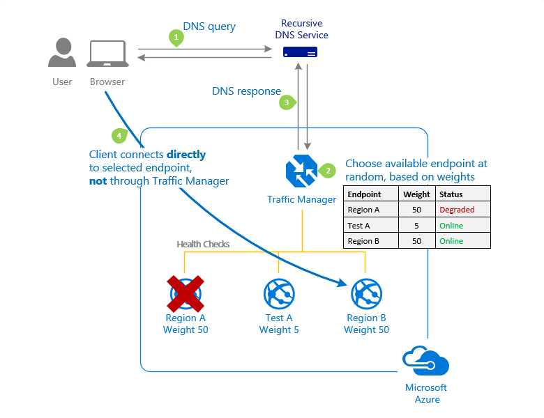

# DevOps

- [DevOps](#devops)
  - [ARM Templates](#arm-templates)
  - [Azure Key Vault](#azure-key-vault)
  - [AKS](#aks)
  - [ACR](#acr)
  - [Helm](#helm)
  - [Azure Devops](#azure-devops)
    - [Artifacts](#artifacts)
    - [CI](#ci)
    - [CD](#cd)
    - [Jenkins](#jenkins)
    - [Repository](#repository)
    - [Agile](#agile)
  - [Monitoring](#monitoring)
    - [Azure Log Analytics](#azure-log-analytics)
  - [Others](#others)
    - [Azure Automation](#azure-automation)
    - [Virtual Machines Desired State Configuration](#virtual-machines-desired-state-configuration)
    - [Azure App Center](#azure-app-center)
    - [Azure Service Fabric](#azure-service-fabric)
    - [Other Tools](#other-tools)

## ARM Templates
* To deploy complex solutions, you can break a template into many templates, and deploy these templates through a main template.
* Use `CustomScriptExtension` to run custom scripts on a VM when it starts.

## Azure Key Vault
Need to enable Azure Key Vault for template deployment so that ARM Template can read secrets from KeyVault (`enabledForTemplateDeployment` property)

## AKS
* Scaling nodes = `az aks scale -g myResourceGroup -n myAKSCluster --node-count 3`
* To allow an AKS cluster to interact with other Azure resources, an `Azure Active Directory service principal` is used.
* `Roles` are used to assign permissions to users for a namespalce, `ClusterRoles` are used to assign permissions for a cluster.
* *Role bindings* are used to assign *roles* for a given *namespace*. If you need to bind roles across the entire cluster, or cluster resources outside a given namespace, you can instead use `ClusterRoleBindings`
* `Docker compose` enables you to bring up multiple containers and run tests. You can use a `docker-compose.yml` file to define two containers that need to work together.
* Scale pods manually - `kubectl scale --replicas=n deployment/[podname]`

## ACR
* Docker + ACR:
  * Log in to a registry - `az acr login --name myregistry` or `docker login myregistry.azurecr.io` if a service principal has been assigned to your registry
  * Create an alias of the image to avoid cluttering the root - `docker tag nginx myregistry.azurecr.io/samples/nginx`. nginx image is copied to samples folder
  * Push image to ACR - `docker push myregistry.azurecr.io/samples/nginx`
  * Pull - `docker pull myregistry.azurecr.io/samples/nginx`
  * Run the image - `docker run -it --rm -p 8080:80 myregistry.azurecr.io/samples/nginx`

## Helm
* Helm init - install tiller on AKS
* Helm install - install helm charts on AKS

## Azure Devops
* Test & Feedback extension
  * `Stakeholder` access to Azure DevOps allows users to use the `Test & Feedback extension` to request for and respond to provide feedback.
  * `Basic` access allows users to use the extension to perform exploratory testing
* Security of Agent Pools
  * `Reader` - View agents and agent pools
  * `Service Account` - Use org agent pools to create project agent pools
  * `Administrator` - Create new agent pools
### Artifacts
* Public Feeds - you need to have a public project to create a public feed. You cannot convert an existing project scoped feed to a public feed.
* .npmrc (npm config) file:
  * in user’s home folder will contain credentials for all of the registries needed. ($Home = linux, $env.Home = win)
  * In project root beside project.json will contain registry info
  * 

### CI
* Java - To deploy complex solutions, you can break a template into many templates, and deploy these templates through a main template.
* Checking the “Batch” option in the triggers tab of a build will reduce the number of times the CI builds will run if multiple check ins are being made. when a pipeline is running, the system waits until the run is completed, then starts another run with all changes that have not yet been built.
* If you are using *Cobetura* or *JaCoCo* to obtain code coverage, you have to use `Publish Code Coverage Results task` to publish code coverage results. You don't need to use this task if you use these tasks in your CI pipeline - VS Test, tests in .net core, Ant, Maven, Gulp, Grunt.
* Setting the value to zero for timeouts in pipelines results in:
  * Self-hosted agents = forever
  * Microsoft-hosted agents with a public project and public repo = 360 mins (6 hrs)
  * Microsoft-hosted agents with a private project and private repo = 60 mins
* Use `Azure DevTest Labs` in pipelines to build code from non-supported languages. Using the `Azure DevTest Labs Tasks Extension` you can integrate setting up VMs with custom images, tools etc. to use them for build and deployment and tear them down when done.

### CD
* Pre/Post Deployment Approvals - Manual Intervention
* Pre/Post Deployment Gates - Automation
* For Blue-Green deployments using weighted routing method use Azure Traffic Manager

* Use `Deployment Groups` in pipelines to deploy to a group of servers. Deployment Groups also allow you to deploy to a subset of servers to perform a safe rolling deployment.
* `App Center Distribute` task - Distribute app builds to testers and users throught app center

### Jenkins
* To allow Jenkins access to ACR, you need to create a service principal in Azure. In Jenkins you need to create a credential resource for the ACR service principal.
* Install Azure Storage Plugin for Jenkins to store build output in Azure Storage.
* To use code from Git repo in Azure Devops:
  * Add Git Url
  * Add a Personal Access Token from DevOps into Jenkins
  * 

### Repository
* User “Choose import from Git repository” to import an existing repo in GitHub to Azure DevOps
* The Azure Boards app for GitHub is the preferred method for integrating Azure Boards with GitHub. By connecting you can support linking between GitHub commits and pull requests to work items in Azure.
* Adding a repo to Azure boards - Add it from GitHub Connections in Azure Devops, project settings.

### Agile
* Cumulative Flow Diagram - Count of work items (over time) for each column of a kanban board
* Cycle Time - Time it takes for your team to complete work items once they begin actively working on them
* Lead Time - Time taken for a feature to be delivered from scratch.

## Monitoring
### Azure Log Analytics
* IT Service Management Connector - allows you to connect Azure and a supported IT Service Management (ITSM) product such as ServiceNow. Ex: when there is an issue a ticket is generated.

## Others
### Azure Automation
* You can store Azure Automation Runbooks in Source Control. GitHub, Azure Repos are supported.
### Virtual Machines Desired State Configuration
* Powershell Desired State Configuration (DSC) - Allows VMs to maintain a desired state.
* Azure Automation State Configuration allows you to write, manage and compile Powershell DSC
* `Import-AzAutomationDscConfiguration -SourcePath 'C:\DscConfigs\TestConfig.ps1' -ResourceGroupName 'MyResourceGroup' -AutomationAccountName 'myAutomationAccount' -Published` - Import/upload a DSC config file
* `Start-AzAutomationDscCompilationJob -ConfigurationName 'TestConfig' -ResourceGroupName 'MyResourceGroup' -AutomationAccountName 'myAutomationAccount'` - compile the config
* `Register-AzAutomationDscNode -ResourceGroupName 'MyResourceGroup' -AutomationAccountName 'myAutomationAccount' -AzureVMName 'DscVm'` - Registers a VM node.
* Register-AzureRmAutomationDscNode - registers a VM node for DSC automation. 
  * ConfigurationMode:
    * ApplyOnly - Only applies config once
    * ApplyAndAutoCorrect - Auto corrects config
    * ApplyAndMonitor - Send alerts when config deviates
* Azure Policy Service can enforce rules over which VM sizes can be created. Applicable for other resources as well. This can be enforced via a gate in CD pipeline

### Azure App Center
* Initialize AppCenter with analytics about crashes - `MSAppcenter.start(“{Your App Secret}”, withServices: [MSAnalytics.self, MSCrashes.self ])`
* Certificate must be in a `.p12` format

### Azure Service Fabric
* For deployment of an application using Azure Pipelines to Azure Service Fabric, you would need to have the cluster endpoint and the Service Certificate Thumbprint.

### Other Tools
* Maven - Java build
* Gradle - Java build
* Chef - Config management, Infra as code
* Puppet - Config management
* Have to use Maven or Gradle for enabling SonarQube Analysis
* Bamboo - CI/CD tool from Altassian
* PMD, FindBugs - Java static code analysis. Can be setup using Maven or Gradle tasks

